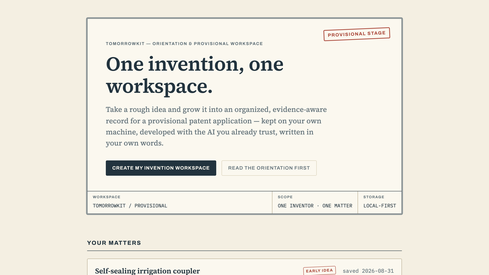
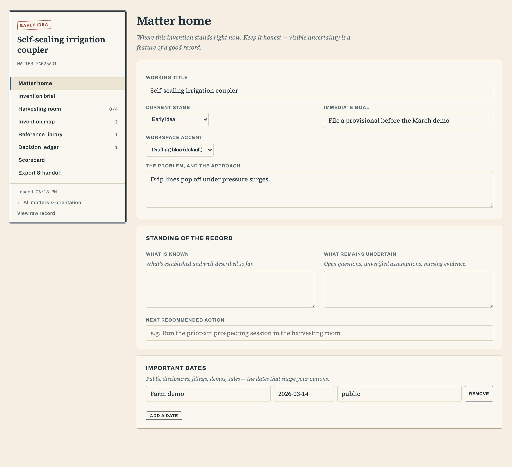

# Tomorrowkit for Minds

**One invention, one workspace.**

Tomorrowkit is a local-first orientation and provisional-patent workspace built
to run inside [Imbue Minds](https://imbue.com/product/minds). It helps an
inventor turn a rough idea into an organized, evidence-aware working record
without pretending to replace professional judgment or file an application.

This repository is an early working prototype and an independent community
project. It is not an official Imbue product and is not endorsed by Imbue.





## What it includes

- A calm, plain-English orientation to the patent journey
- One private matter workspace per invention
- An editable invention brief in the inventor's own language
- Guided harvesting checkpoints for use with the inventor's existing agent
- An Invention Map for components, flows, alternatives, and open questions
- A living Reference Library for patents, papers, products, standards, and leads
- A Decision Ledger recording important human choices and rationale
- Separate IVS and PAS self-review lenses for the provisional stage
- Portable Markdown and JSON exports

The product deliberately excludes multi-model council claims, formal patent
drawings, filing automation, legal conclusions, and non-provisional/PCT
prosecution scoring. See [the architecture brief](docs/architecture.md) for the
product reasoning and intended future direction.

## Why Minds

Tomorrowkit is designed as a vertical application inside a user-controlled
personal computing environment. The application stores each matter as a local
JSON record, makes uncertainty visible, and gives the inventor a complete
export rather than trapping the work in a hosted service.

The app itself does not call an AI provider. Harvesting checkpoints create
context-rich prompts that the user copies into an agent they already trust.

## Requirements

- A current Minds workspace
- Python 3.11 or later
- `uv`
- The `imbue-common` package supplied by the Minds workspace (or PyPI for
  standalone development)

Minds currently has its own
[FCL-1.0-MIT license](https://github.com/imbue-ai/mngr/blob/main/apps/minds/LICENSE).
That license governs Minds itself; this repository contains only the
Tomorrowkit application.

## Install into Minds

From the root of a Minds workspace:

1. Copy or clone this repository to `system/apps/tomorrowkit/`.
2. Add `"tomorrowkit"` to `[project].dependencies` in the workspace's root
   `pyproject.toml`.
3. Add `tomorrowkit = { workspace = true }` to `[tool.uv.sources]`.
4. Run `uv sync --all-packages`.
5. Append the contents of
   [`supervisord-program.snippet.conf`](supervisord-program.snippet.conf) to
   `system/supervisord.conf`, choosing a free port if 8090 is occupied.
6. Run `supervisorctl reread && supervisorctl update`.

The application will appear at `/service/tomorrowkit/` after the Minds service
proxy discovers it.

## Run locally for development

```bash
uv sync --all-groups
uv run --no-project --with . tomorrowkit
```

Then open `http://127.0.0.1:8090`.

Run the tests with:

```bash
uv run pytest
```

## Data and privacy

By default, matter records are stored as plaintext JSON under
`data/.apps/tomorrowkit/matters/`. Set `TOMORROWKIT_DATA_DIR` to use another
location and `TOMORROWKIT_PORT` to change the local port.

The server binds to `127.0.0.1` and is intended to run behind Minds. It has no
built-in user authentication and should not be exposed directly to a public
network. Read [SECURITY.md](SECURITY.md) before changing its deployment model.

## Legal boundary

Tomorrowkit organizes an inventor-controlled working record. It does not file
applications, determine inventorship, provide legal advice, or guarantee that
any disclosure supports a later claim. Patent rights and deadlines depend on
the facts and jurisdiction; obtain qualified advice when the stakes warrant it.

## Third-party materials

The bundled Archivo, IBM Plex Mono, and Source Serif 4 fonts are licensed under
the SIL Open Font License 1.1. See
[THIRD_PARTY_NOTICES.md](THIRD_PARTY_NOTICES.md).

## License

Tomorrowkit is available under the
[Fair Core License 1.0 with an MIT future license](LICENSE.md). Noncompeting
use is permitted immediately; each version becomes available under MIT two
years after its release. This follows the licensing approach used by Minds
while keeping Tomorrowkit independently owned and distributed.

## Project status

Version 0.1 is intentionally narrow: orientation, structured provisional-stage
work, references, decisions, and export. The most important future extension
is a genuine Council Room with independent model contexts and explicit
reconciliation—not a single-agent simulation of consensus.
