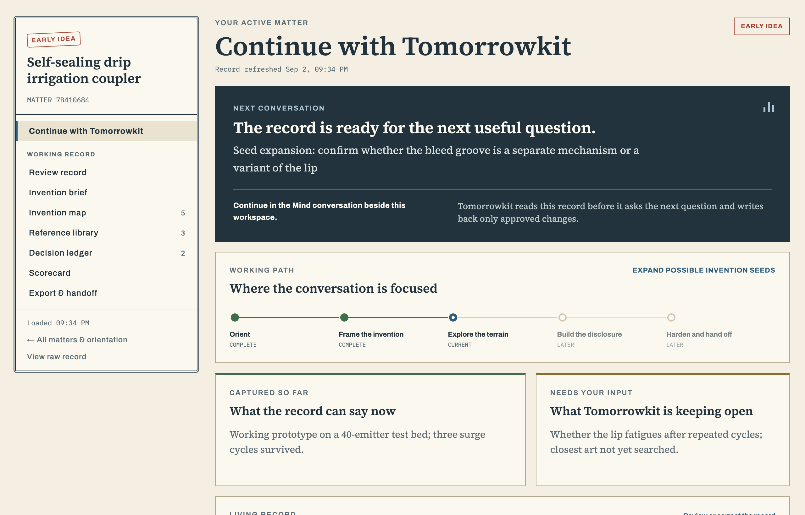
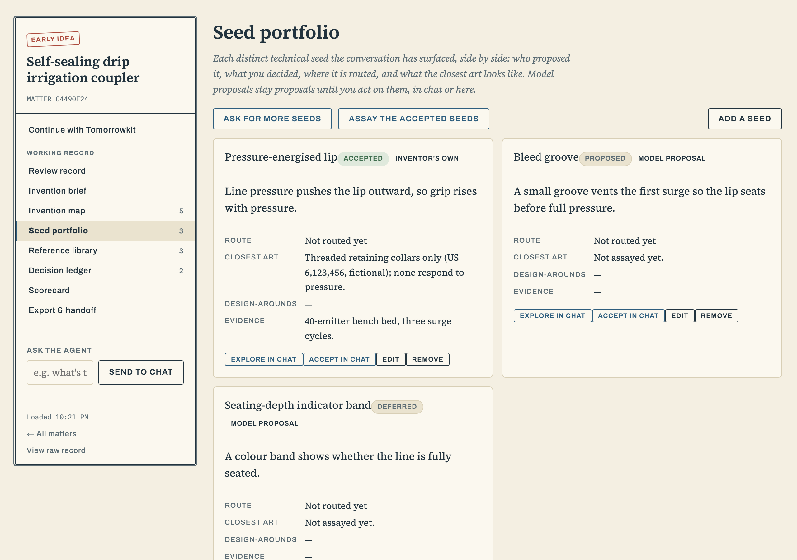
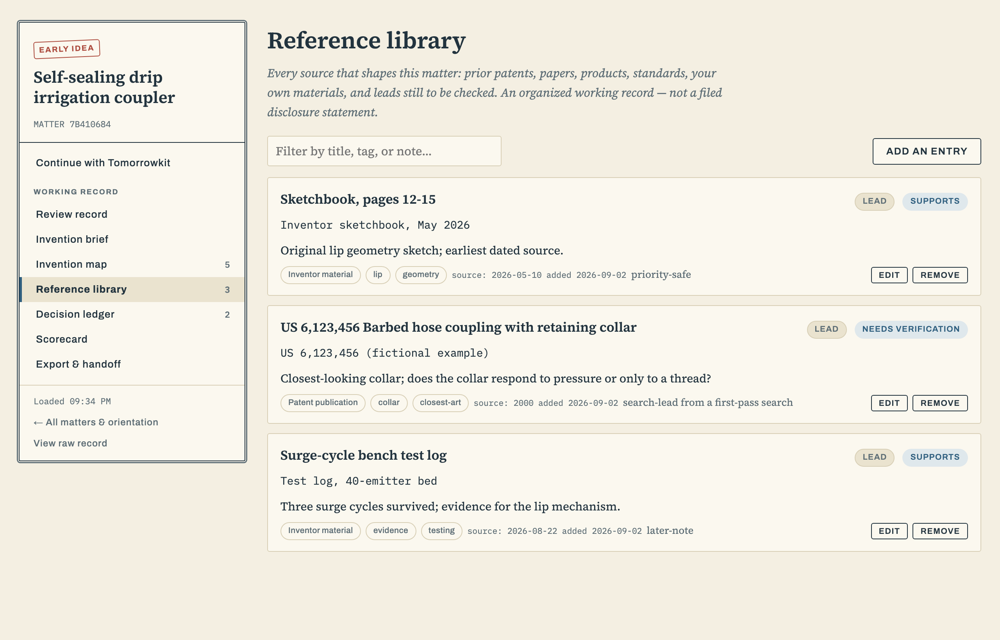

# Tomorrowkit

**Tell Tomorrowkit how the invention works. Watch the record take shape.**

Tomorrowkit is a private, conversational invention workspace for
[Imbue Minds](https://imbue.com/product/minds). The Mind interviews a solo
inventor one question at a time and keeps a source-aware provisional-patent
record beside the chat: an invention brief in the inventor's own words, a
visual Invention Map, a Reference Library with provenance labels, a Decision
Ledger, two score lenses that are never averaged, and a portable export.

> This is a **Minds template**: a bootable snapshot of an app one mind built,
> published so another mind can be created *from* it. It ships with a
> `welcome` skill that starts the invention conversation on the first turn.
> See [Adopting this](#adopting-this) below. The screenshots on this page use
> entirely fictional sample data.

Tomorrowkit is an independent community project, not an official Imbue
product and not endorsed by Imbue.



## The problem it solves

AI made patent drafting cheap. It did not solve the hard parts: what is
actually worth protecting, what should stay out of the first disclosure, and
how to show what the human inventor conceived. Most tools answer by
generating a long draft on the first turn. Tomorrowkit answers by asking. The
inventor explains the mechanism in their own words, the record grows after
every answer, model proposals stay labelled as proposals until the inventor
accepts them, and nothing leaves the Mind.

## How it works

Three parts share one local matter:

- **The `tomorrowkit-provisional` skill does the interview.** It walks a gated
  state machine (Welcome, Triage Quiz, Source Lock, Objective Lock, Core
  Mechanism, Seed Expansion, Seed Assay, Terrain Selection, Provisional
  Posture, Disclosure Build, Attack/Repair, Ready/Handoff), asks one useful
  question per turn, and stops at every decision only the inventor can make.
- **The Tomorrowkit tab shows the record.** A small Flask app renders the
  brief, map, references, decisions, score lenses, and export as a tab beside
  the chat. It is a review and correction surface; the inventor never has to
  fill in a form to make progress.
- **The `tomorrowkit-workspace` command is the bridge.** The agent lists,
  creates, reads, and applies revision-checked patches to the record without
  HTTP or file editing. A stale write is rejected and reconciled, never
  overwritten. Its `next` command tells the agent what the record still lacks
  and what to ask about; `advance` moves the phase marker only when the record
  supports it.

## The tab talks back



The inventor never has to fill anything in, but the tab is not passive. Every
card carries buttons that type a message into the chat in the inventor's own
voice: run a quick orientation quiz, look for more seeds, explore or accept a
seed, verify a lead, walk through the three postures, assess value now, or ask
anything in one line. The agent answers in the conversation and the record
refreshes behind it. The buttons use the workspace's own chat API on loopback,
so nothing leaves the Mind.

## The first five minutes

On a new Mind, Tomorrowkit asks five short questions, one at a time: where
the invention stands, whether it has been disclosed, what the patent work
should accomplish, what source material exists, and how the inventor wants to
work. Each answer gets one contextual sentence about why it matters. After the
first answered category the agent creates an untitled matter and opens the
tab, so every later answer has somewhere to land. When the five are covered,
the technical interview begins and the first mechanism answers supply a real
working title. On a returning Mind it reads the existing matter and resumes at
the next material gap.

## The living record



The record separates what existed by the relevant date from what came later:

- `priority-safe` inventor material, `later-note` inventor additions,
  `external-reference` public material, `generated` model proposals, and
  `search-lead` or `IDS-candidate` public references still to be reviewed;
- a seed portfolio: each distinct mechanism with who proposed it, the
  inventor's disposition, its route, and its closest-art and evidence notes;
- the provisional posture, chosen and approved by the inventor after terrain
  selection;
- a Decision Ledger of the objective, terrain, embodiment, deferral, and
  disclosure choices the inventor confirmed, with their reasons;
- an Invention Value Score and a Priority Asset Score kept apart, with
  coverage and evidence visible, and the Priority Asset Score left unassessed
  until a complete provisional candidate exists;
- Markdown, JSON, and ZIP export of the whole matter.

"No result found" is never treated as proof of novelty. Model output alone is
never treated as inventor source. Tomorrowkit does not run a word-by-word
origin audit either: in a directed inventor-and-model session the directing
human is the inventor, and their framing, steering, selection, and adoption of
the settled solution are preserved as such.

## Adopting this

This repo is a bootable snapshot. When a new mind is created from it, the
`welcome` skill runs on the first turn and starts the conversation:

- **Nothing to connect.** Tomorrowkit needs no permissions, secrets, or API
  keys. No code in the snapshot calls an AI provider or an external API; the
  interview runs on the agent already configured for the Mind.
- **Nothing to fill in.** The first thing the inventor sees is one question in
  chat. The tab opens on its own once a matter exists.
- **Everything stays local.** Matter records are plaintext JSON under
  `data/.apps/tomorrowkit/` and follow the workspace's normal persistence and
  backup behaviour. Read [SECURITY.md](SECURITY.md) before exposing the
  service outside the Mind; it binds to localhost and has no authentication
  layer of its own.

The adaptation guide lives in [`template.md`](template.md), the manifest an
adopting agent reads, with the machine-readable half in
[`template.toml`](template.toml). Its adaptation list names the things an
adopter may want to change: the port and where the tab's buttons deliver messages.

To adopt it from an existing mind instead, give that mind the repo URL and
ask it to use the template.

## Boundaries

Tomorrowkit organizes and pressure-tests an inventor-controlled working
record. It does not determine patentability, guarantee priority, give a legal
conclusion, create filing-standard drawings, sign forms, certify entity status,
spend money, or file or submit anything to a patent office.
Formal non-provisional or international claims, prosecution scoring, and
filing automation belong to later, separately authorized workflows.

## What ships here

- `system/apps/tomorrowkit` -- the Flask record service, the
  `tomorrowkit-workspace` bridge, the record model, storage, and export.
- `.agents/skills/tomorrowkit-provisional` -- the interview skill.
- `.agents/skills/welcome` -- the first-turn welcome that starts it.
- `template.md`, `template.toml`, `template.svg` -- the template manifest.

Everything else is the stock Minds workspace this snapshot was built on.

## Development

```bash
uv sync --all-packages
uv run pytest system/apps/tomorrowkit
uv run pyright system/apps/tomorrowkit/src/tomorrowkit
```

On a Mac outside a Mind, two of the workspace's browser dependencies ship
Linux-only wheels. Sync with:

```bash
uv sync --all-packages --all-groups --no-install-package pcmflux --no-install-package pixelflux
```

Do not `uv pip install` into this environment: it drops the workspace's
editable packages from `sys.path` and every `imbue.*` import fails until the
next `uv sync`.

For service-only work outside a Mind:

```bash
TOMORROWKIT_DATA_DIR=/tmp/tomorrowkit-data uv run tomorrowkit
```

Then open `http://127.0.0.1:8090`. The full product runs in a Mind because the
conversation is the primary surface.

## Lineage and license

Tomorrowkit grows out of the
[Provisionally Tomorrow Kit](https://github.com/tymrtn/provisionally-tomorrow-kit),
a pro se patent-drafting workflow for solo inventors, and is maintained by
Tyler Martin at [provisionally.xyz](https://provisionally.xyz). The first
version of this repo was published as a v1 Minds inspiration on 2026-08-31 and
is kept at the `v1-inspiration` tag; `template.toml` records it as lineage.

Tomorrowkit-specific code and documentation are available under the
[Fair Core License 1.0 with an MIT future license](LICENSE.md). Noncompeting
use is permitted immediately; each version becomes available under MIT two
years after release. The Minds workspace base and bundled third-party
components remain under their own licenses; font notices are collected in
[THIRD_PARTY_NOTICES.md](THIRD_PARTY_NOTICES.md).
